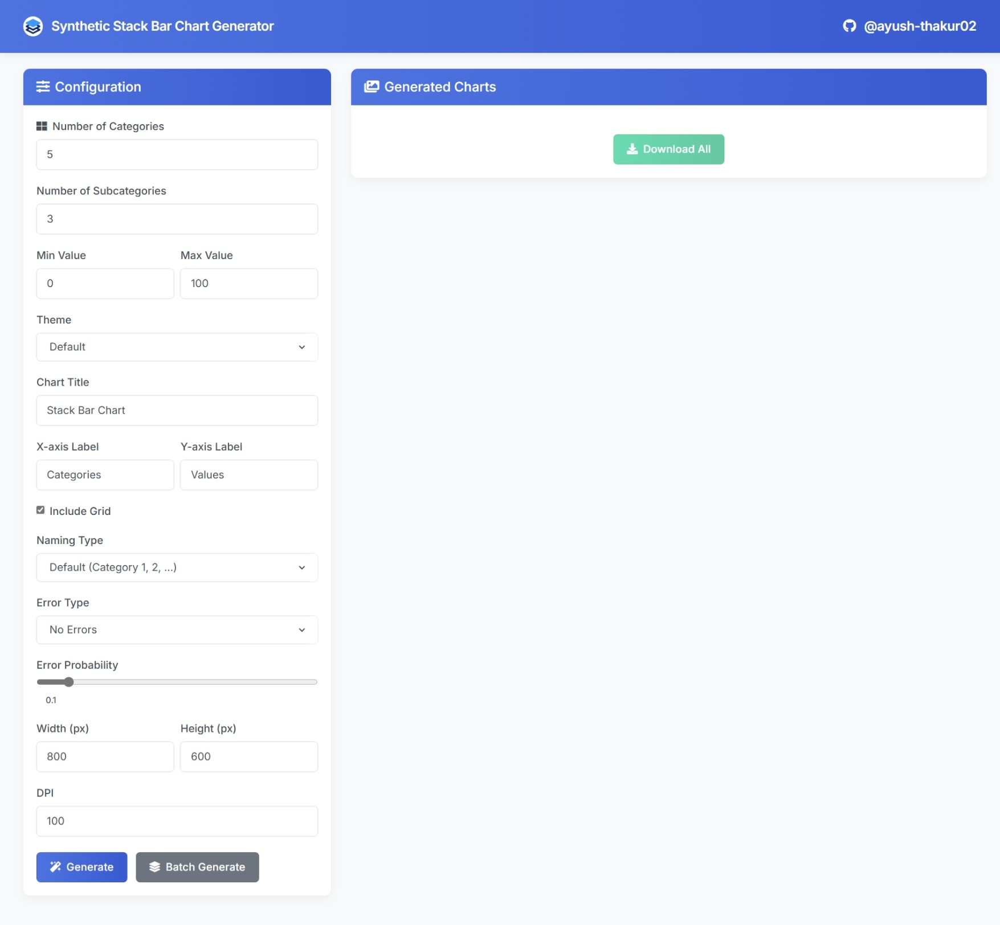

# 📊 Synthetic Data Generator

> 🔄 Generate realistic synthetic data visualizations with customizable parameters for testing, demonstration, and development purposes.

<p align="center">
Screenshot:
    
</p>

## ✨ Features

- **Interactive UI** for generating custom stacked bar charts
- **Batch generation** for creating multiple charts with varying parameters
- **Customizable parameters** including:
  - Number of categories and subcategories
  - Value ranges
  - Visual themes (default, dark, seaborn, bmh, ggplot)
  - Chart dimensions and resolution
  - Error simulation for testing visualization robustness
- **Flexible naming options** for categories:
  - Default numbered naming
  - Custom user-defined names
  - Random name generation from predefined lists
  - Dynamic name generation with the randomname library
- **Data export** in JSON format with detailed metadata
- **Batch management** for organizing generated visualizations

## 🚀 Installation

### Prerequisites

- Python 3.8+
- pip (Python package manager)

### Setup

1. **Clone the repository**

   ```bash
   git clone https://github.com/ayush-thakur02/synthetic-graph-generator
   cd synthetic-data-generator
   ```

2. **Create a virtual environment (recommended)**

   ```bash
   python -m venv venv

   # On Windows
   venv\Scripts\activate

   # On macOS/Linux
   source venv/bin/activate
   ```

3. **Install dependencies**

   ```bash
   pip install flask numpy pandas matplotlib seaborn randomname
   ```

4. **Run the application**

   ```bash
   python app.py
   ```

5. **Access the application**

   Open your web browser and navigate to [http://127.0.0.1:5000/](http://127.0.0.1:5000/)

## 📊 Usage

### Single Chart Generation

1. Navigate to the main page
2. Configure your chart parameters:
   - Set the number of categories and subcategories
   - Define value ranges
   - Choose a visual theme
   - Set chart title and axis labels
   - Configure error simulation (optional)
3. Click "Generate Chart" to create your visualization
4. Download the generated chart and/or the associated data

### Batch Generation

1. Configure base parameters for your batch
2. Set the batch size (number of charts to generate)
3. Define the range of categories and subcategories
4. Click "Generate Batch" to create multiple visualizations
5. Review the generated charts and select which ones to download
6. Download selected charts as a batch with associated data

## 📁 Project Structure

```
synthetic-data-generator/
├── app.py                # Flask application with main functionality
├── static/               # Static assets
│   ├── css/              # CSS stylesheets
│   ├── js/               # JavaScript files
│   ├── stack-app.svg     # Favicon
│   └── generated/        # Directory for generated visualizations
├── templates/            # HTML templates
│   └── index.html        # Main application interface
├── requirements.txt      # Python dependencies
└── README.md             # This documentation file
```

## 🛠️ Technologies Used

- **Backend**: Flask, Python
- **Data Processing**: Pandas, NumPy
- **Visualization**: Matplotlib, Seaborn
- **Frontend**: HTML, CSS, JavaScript
- **Data Format**: JSON

## 🤝 Contributing

Contributions are welcome! Please feel free to submit a Pull Request.

1. Fork the repository
2. Create your feature branch (`git checkout -b feature/amazing-feature`)
3. Commit your changes (`git commit -m 'Add some amazing feature'`)
4. Push to the branch (`git push origin feature/amazing-feature`)
5. Open a Pull Request

## 📝 License

This project is licensed under the MIT License - see the [LICENSE](LICENSE) file for details.

## 👏 Acknowledgments

- [Matplotlib](https://matplotlib.org/) for the visualization capabilities
- [Flask](https://flask.palletsprojects.com/) for the web framework
- [randomname](https://github.com/skyreaper925/randomname) for dynamic name generation
